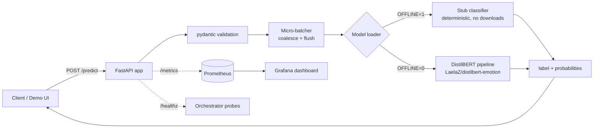

# distilbert-emotion-api

A batched, observable, deploy-ready FastAPI inference service that serves the fine-tuned [`LaelaZ/distilbert-emotion`](https://huggingface.co/LaelaZ/distilbert-emotion) classifier, and runs **fully offline** for development, CI, and load testing.

## The problem

Training a model is the easy half. The half that actually matters is everything around it: a typed HTTP contract, input validation, health probes, metrics a dashboard can read, request batching so throughput doesn't fall over under load, a container, and a deploy story. And none of that should require downloading 270 MB of weights (or a GPU, or network access) just to run the tests or demo the API.

This repo is that production layer for an emotion classifier (six emotions: sadness, joy, love, anger, fear, surprise, with full per-class probabilities), built so the entire service, its demo UI, its test suite, and its load test run with **zero downloads** by swapping the model for a deterministic stub when `OFFLINE=1`. Flip `OFFLINE=0` and the same code path loads the real DistilBERT from the Hub.

> **The deployed [Hugging Face Space](https://huggingface.co/spaces/LaelaZ/distilbert-emotion-api) runs the real fine-tuned model** (built `WITH_MODEL=1`, `OFFLINE=0`), so the public demo serves genuine DistilBERT predictions (acc 0.920 / macro F1 0.874). The lean, torch-free offline stub is what powers CI, local `docker compose`, and the load test, so development stays instant and key-free.

## What it does

- **`POST /predict`** takes single (`{"text": ...}`) or batch (`{"texts": [...]}`) input, pydantic-validated, and returns the top label plus the full probability distribution.
- **`GET /healthz`** is readiness and liveness; it returns 503 until the model is loaded and the batcher is running.
- **`GET /metrics`** is Prometheus exposition: request count, latency histogram, in-flight gauge, error count, plus model-level inference latency and batch-size histograms.
- **Dynamic micro-batching** coalesces concurrent single requests into one forward pass for throughput, with a latency cap you control.
- **Offline stub:** a deterministic, lexicon-driven classifier, so the API behaves (and tests pass) with no weights.
- **Built-in demo UI** at `/demo` that calls the live API.



## Results / impact

Latency and throughput measured by the included load test (`scripts/loadtest.py`) hitting `POST /predict` against the **offline stub**, single uvicorn worker, on an Apple-silicon laptop. Numbers are reproducible from a clean checkout with no downloads:

```bash
make bench          # human-readable summary
make bench-table    # the markdown row below
```

| concurrency | throughput (req/s) | p50 (ms) | p95 (ms) | p99 (ms) |
|---|---|---|---|---|
| 1  | 118 | 8.27  | 8.87  | 13.12  |
| 8  | 595 | 13.35 | 16.49 | 19.97  |
| 16 | 604 | 19.03 | 67.49 | 107.39 |

Throughput scales ~5x from serial to 8 concurrent requests as the micro-batcher coalesces forward passes, while p50 stays in the low-teens of milliseconds; all runs completed with **0 errors**. (These reflect the stub plus full HTTP/validation/batching overhead. The real model adds per-call inference cost on top, but the service shape, the batching wins, and the tail-latency behavior are what's being measured here.)

## Quickstart

No model download, no GPU, no network. `OFFLINE=1` is the default.

```bash
python -m venv .venv && source .venv/bin/activate
pip install -r requirements-dev.txt

make test         # full suite, offline, < 1s
make demo         # serve API + UI at http://localhost:8000/demo
```

Call it:

```bash
curl -s -X POST http://localhost:8000/predict \
  -H 'Content-Type: application/json' \
  -d '{"text": "i can'\''t stop smiling, today went better than i ever hoped"}'
# {"label":"joy","score":0.74,"probabilities":{"sadness":...,"joy":0.74,...}}

curl -s -X POST http://localhost:8000/predict \
  -H 'Content-Type: application/json' \
  -d '{"texts": ["i am so scared right now", "how dare they"]}'
# {"predictions":[{"label":"fear",...},{"label":"anger",...}]}
```

Run the **real** model instead of the stub:

```bash
pip install -r requirements-ml.txt     # adds torch + transformers
OFFLINE=0 make serve                   # loads LaelaZ/distilbert-emotion from the Hub
```

## Tech stack

- **API:** FastAPI + Uvicorn, pydantic v2 validation
- **Model:** Hugging Face `transformers` pipeline over the fine-tuned DistilBERT (`LaelaZ/distilbert-emotion`); deterministic lexicon stub for the offline path
- **Throughput:** custom async micro-batcher (asyncio queue + threaded forward pass)
- **Observability:** `prometheus-client`, Prometheus, Grafana (provisioned dashboard)
- **Packaging/CI:** multi-stage slim Docker image (non-root), GitHub Actions
- **IaC:** Fly.io (`fly.toml`), Render (`render.yaml`), Terraform stub (`deploy/terraform/`)
- **Load test:** asyncio + httpx benchmark script

## Deploy

The image runs in offline mode by default, so every target below comes up with no external dependencies. For the real model, build from `requirements-ml.txt`, set `OFFLINE=0`, and give the machine more memory (>= 2 GB for torch + weights).

**Docker (local):**
```bash
make docker-run          # build the slim image and run it on :8000
```

**Full stack with monitoring:**
```bash
make compose-up          # API :8000, Prometheus :9090, Grafana :3000
```

**Fly.io:**
```bash
fly launch --no-deploy   # reads fly.toml
fly deploy
```

**Render:** connect the repo; it picks up `render.yaml` automatically.

**Terraform (Fly provider):**
```bash
cd deploy/terraform
export FLY_API_TOKEN=$(fly auth token)
terraform init
terraform apply -var="image=ghcr.io/laelazorana/distilbert-emotion-api:latest"
```

CI (`.github/workflows/ci.yml`) runs the offline tests, builds the image, and smoke-tests it. The GHCR push step is present but **guarded off** (`if: false`), so CI never publishes. Flip the guard to enable a real release.

## Monitoring

`docker compose up` brings up Prometheus (scraping `/metrics` every 5s) and Grafana with a pre-provisioned **Service Overview** dashboard (`observability/grafana/dashboards/emotion-api.json`):

- Request rate, error rate (5xx %), in-flight requests, p95 latency (stat tiles)
- HTTP latency percentiles (p50/p95/p99) over time
- Request rate by status code
- **Model inference latency** (separated from HTTP overhead, so "model is slow" vs "framework is slow" is visible)
- Average inference batch size (shows the batcher working under load)

Open Grafana at `http://localhost:3000` (anonymous viewer; `admin`/`admin` to edit). Generate traffic with `make bench` and watch the panels move.

Exported metrics: `emotion_api_requests_total`, `emotion_api_request_latency_seconds`, `emotion_api_errors_total`, `emotion_api_requests_in_progress`, `emotion_api_inference_latency_seconds`, `emotion_api_inference_batch_size`.

## Project layout

```
distilbert-emotion-api/
├── app/
│   ├── __init__.py        # labels + version
│   ├── config.py          # env-driven settings
│   ├── classifier.py      # model abstraction: stub + real transformers backend
│   ├── batching.py        # async micro-batcher
│   ├── schemas.py         # pydantic request/response models
│   ├── metrics.py         # Prometheus collectors + middleware
│   └── main.py            # FastAPI app, routes, lifespan
├── demo/index.html        # zero-dependency demo UI that calls /predict
├── scripts/loadtest.py    # asyncio/httpx latency + throughput benchmark
├── tests/                 # /predict, validation, stub, batcher, health, metrics
├── observability/         # Prometheus + Grafana provisioning + dashboard
├── deploy/terraform/      # Terraform stub (Fly provider)
├── Dockerfile             # multi-stage slim image (non-root)
├── docker-compose.yml     # API + Prometheus + Grafana
├── fly.toml · render.yaml # IaC for managed platforms
├── .github/workflows/ci.yml
└── Makefile
```

## License

MIT. Copyright (c) 2026 Laela Zorana. See [LICENSE](LICENSE).

**Links:** [GitHub](https://github.com/LaelaZorana) · [Model on the Hub](https://huggingface.co/LaelaZ/distilbert-emotion) · [HuggingFace](https://huggingface.co/LaelaZ)
